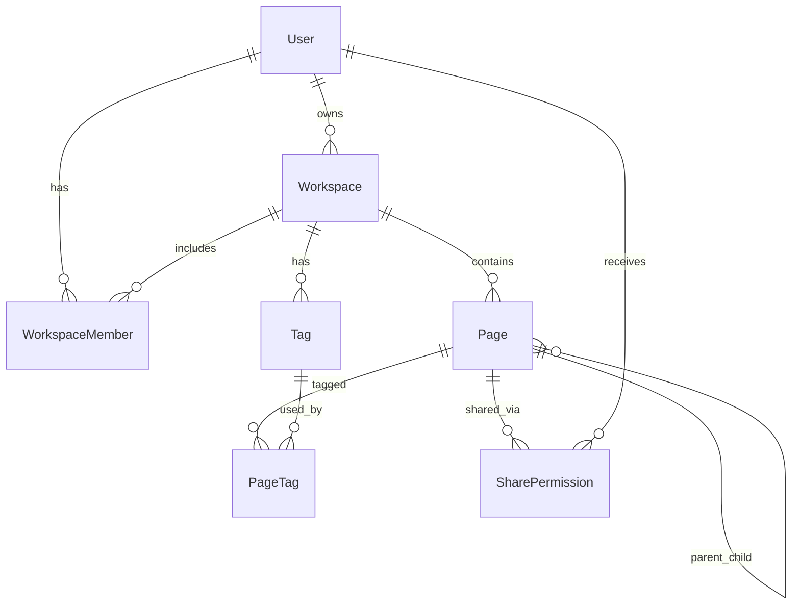

# NotionLite

A production-style mini Notion clone built with Next.js, TypeScript, PostgreSQL, Prisma, Clerk, TipTap, and OpenAI.

## Features

- Sign up / login with Clerk
- Create and manage workspaces
- Rich text page editor (TipTap) with auto-save
- Nested pages in a Notion-style sidebar
- Tags on pages
- Search by page title and tags
- Share pages with view/edit permissions
- Workspace RBAC: `OWNER`, `EDITOR`, `VIEWER`
- AI study-note summary generator per page

## Tech Stack

- **Frontend + Backend:** Next.js 16 (App Router) + TypeScript
- **Database:** PostgreSQL
- **ORM:** Prisma
- **Auth:** Clerk
- **UI:** Tailwind CSS + shadcn-style components
- **Editor:** TipTap
- **AI:** OpenAI API
- **Deploy:** Vercel + Supabase/Neon PostgreSQL

## Database Diagram



## Getting Started

### 1. Install dependencies

```bash
npm install
```

### 2. Configure environment

Copy `.env.example` to `.env` and fill in values:

```bash
cp .env.example .env
```

### 3. Set up PostgreSQL

Use a local Postgres instance, Supabase, or Neon. Update `DATABASE_URL` in `.env`.

### 4. Run migrations

```bash
npm run db:migrate
```

For quick prototyping without migration history:

```bash
npm run db:push
```

### 5. Start the dev server

```bash
npm run dev
```

Open [http://localhost:3000](http://localhost:3000).

## Environment Variables

See **[ENV_SETUP.md](./ENV_SETUP.md)** for database and OpenAI setup.

For **Clerk authentication via CLI**, see **[CLERK_SETUP.md](./CLERK_SETUP.md)**.

Quick Clerk setup:

```bash
npm install -g clerk
clerk auth login
clerk init --framework next --pm npm
clerk doctor
npm run dev
```

| Variable | Description |
|---|---|
| `DATABASE_URL` | PostgreSQL connection string |
| `NEXT_PUBLIC_CLERK_PUBLISHABLE_KEY` | Clerk publishable key |
| `CLERK_SECRET_KEY` | Clerk secret key |
| `NEXT_PUBLIC_CLERK_SIGN_IN_URL` | `/sign-in` (keep as-is) |
| `NEXT_PUBLIC_CLERK_SIGN_UP_URL` | `/sign-up` (keep as-is) |
| `NEXT_PUBLIC_CLERK_AFTER_SIGN_IN_URL` | `/dashboard` (keep as-is) |
| `NEXT_PUBLIC_CLERK_AFTER_SIGN_UP_URL` | `/dashboard` (keep as-is) |
| `OPENAI_API_KEY` | Required for AI summarize feature |

## API Routes

| Method | Route | Description |
|---|---|---|
| `POST` | `/api/pages/[id]/summarize` | Generate and save AI summary for a page |

Server actions handle workspace, page, tag, and sharing operations.

## Project Structure

```text
src/
  app/
    dashboard/
    workspace/[id]/
    page/[id]/
    sign-in/
    sign-up/
    api/pages/[id]/summarize/
  components/
  lib/
  server/actions/
prisma/
  schema.prisma
```

## RBAC Rules

| Role | Permissions |
|---|---|
| `OWNER` | Delete workspace, invite members, full page access |
| `EDITOR` | Create/edit pages, share pages |
| `VIEWER` | Read-only workspace access |

Page-level shares can grant `VIEW` or `EDIT` to users outside the workspace membership.

## Future Improvements

- PostgreSQL full-text search inside page content
- Real-time collaboration
- Page version history
- Drag-and-drop page reordering
- Workspace templates
- Offline-first sync mode

## Scripts

```bash
npm run dev          # Start development server
npm run build        # Generate Prisma client and build app
npm run db:generate  # Generate Prisma client
npm run db:migrate   # Run database migrations
npm run db:push      # Push schema without migrations
npm run db:studio    # Open Prisma Studio
```

## License

MIT
