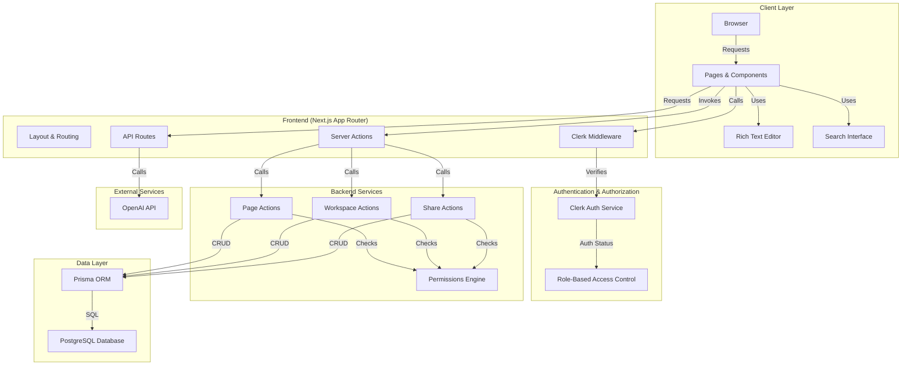
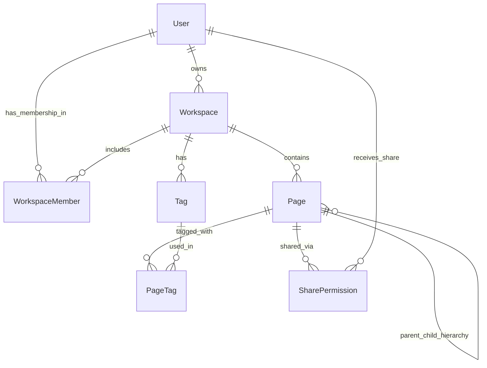
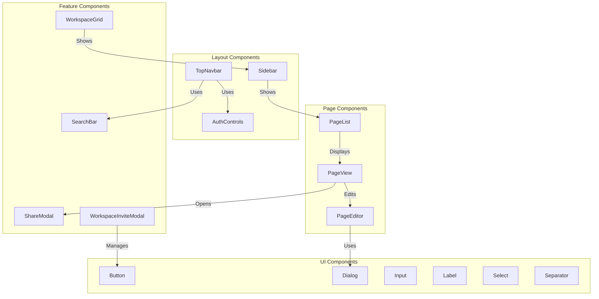

# NotionLite - Project Documentation

## Project Overview

**NotionLite** is a production-style mini Notion clone built as a full-stack web application. It's a collaborative workspace management tool where users can create workspaces, write rich-text pages, organize content with tags, and share pages with workspace members. The application features role-based access control (RBAC), real-time collaboration capabilities, and AI-powered content summarization.

### Vision
Create a lightweight, fully-featured alternative to Notion that demonstrates modern web development practices using Next.js, TypeScript, PostgreSQL, and Clerk authentication.

---

## Tech Stack

### Frontend & Backend
- **Framework:** Next.js 16 (App Router, Server Components, API Routes)
- **Language:** TypeScript
- **Styling:** Tailwind CSS v4 + PostCSS
- **UI Components:** Radix UI + shadcn-style custom components

### Database & ORM
- **Database:** PostgreSQL
- **ORM:** Prisma (v7.8.0 with pg adapter)
- **Adapter:** @prisma/adapter-pg

### Authentication & Authorization
- **Auth Service:** Clerk (v7.5.3)
- **Middleware:** Clerk middleware for route protection
- **RBAC Roles:** OWNER, EDITOR, VIEWER

### Rich Text Editor
- **Library:** TipTap (v3.27.0)
- **Extensions:** Starter kit, code-block with syntax highlighting (lowlight)
- **Features:** Placeholder support, rich formatting

### AI & Analytics
- **AI Service:** OpenAI API (GPT models)
- **Use Case:** Study note summarization per page

### Testing & Quality
- **Test Framework:** Vitest (v4.1.9)
- **Testing Library:** @testing-library/react (v16.3.2)
- **Test Utilities:** jsdom (v29.1.1)
- **Linting:** ESLint v9
- **Type Checking:** TypeScript strict mode
- **Security:** npm audit

### Deployment
- **Platform:** Vercel
- **Database Hosting:** Neon PostgreSQL

---

## Architecture Diagram

### System Architecture


### Database Schema Diagram


### Component Architecture


---

## Database Schema

### Core Models

#### User
- `id` (CUID, Primary Key)
- `clerkId` (Unique, from Clerk)
- `email` (Unique)
- `name` (Optional)
- `createdAt`, `updatedAt`
- Relations: Owns workspaces, has memberships, receives shares

#### Workspace
- `id` (CUID, Primary Key)
- `name` (String)
- `ownerId` (Foreign Key to User)
- `createdAt`, `updatedAt`
- Relations: Has owner, members, pages, tags

#### WorkspaceMember
- `id` (CUID, Primary Key)
- `workspaceId` (Foreign Key)
- `userId` (Foreign Key)
- `role` (Enum: OWNER, EDITOR, VIEWER)
- `createdAt`
- Unique constraint: (workspaceId, userId)

#### Page
- `id` (CUID, Primary Key)
- `title` (String, default: "Untitled")
- `content` (JSON - TipTap editor state)
- `summary` (String - AI-generated)
- `workspaceId` (Foreign Key)
- `parentId` (Foreign Key - self-referencing for hierarchy)
- `createdAt`, `updatedAt`
- Relations: Workspace, parent/children pages, tags, shares

#### Tag
- `id` (CUID, Primary Key)
- `name` (String)
- `workspaceId` (Foreign Key)
- `createdAt`
- Unique constraint: (workspaceId, name)

#### PageTag
- `pageId` (Foreign Key)
- `tagId` (Foreign Key)
- Composite Primary Key: (pageId, tagId)

#### SharePermission
- `id` (CUID, Primary Key)
- `pageId` (Foreign Key)
- `userId` (Foreign Key)
- `role` (Enum: VIEW, EDIT)
- `createdAt`
- Unique constraint: (pageId, userId)

---

## Features Implemented

### 1. Authentication & Authorization
- ✅ Sign up / login with Clerk
- ✅ Persistent session management
- ✅ Middleware-based route protection
- ✅ Role-based access control (OWNER, EDITOR, VIEWER)
- ✅ Share-level permissions (VIEW, EDIT)

### 2. Workspace Management
- ✅ Create and manage workspaces
- ✅ Workspace ownership (owner creates, manages members)
- ✅ Add/remove members from workspaces
- ✅ Role assignment for members
- ✅ Workspace grid display in dashboard

### 3. Page Management
- ✅ Create, read, update, delete pages
- ✅ Nested page hierarchy (parent-child relationships)
- ✅ Notion-style sidebar navigation
- ✅ Auto-save functionality
- ✅ Page titles and metadata

### 4. Rich Text Editing
- ✅ TipTap editor integration
- ✅ Rich formatting (bold, italic, underline, etc.)
- ✅ Code blocks with syntax highlighting
- ✅ Placeholder text support
- ✅ JSON content storage

### 5. Tagging & Organization
- ✅ Create tags within workspaces
- ✅ Apply tags to pages
- ✅ Multi-tag support per page
- ✅ Tag-based filtering and search

### 6. Search Functionality
- ✅ Search pages by title
- ✅ Filter by tags
- ✅ Real-time search interface
- ✅ Search results display

### 7. Page Sharing
- ✅ Share individual pages with users
- ✅ View permission (read-only access)
- ✅ Edit permission (modify content)
- ✅ Revoke share access
- ✅ Share modal interface

### 8. AI Features
- ✅ Study-note summarization per page (OpenAI integration)
- ✅ Summary storage and retrieval
- ✅ Summarize endpoint (/api/pages/[id]/summarize)

### 9. User Interface
- ✅ Responsive design with Tailwind CSS
- ✅ Top navigation bar with user menu
- ✅ Sidebar with workspace/page navigation
- ✅ Search bar in navbar
- ✅ Modal dialogs for sharing and invites
- ✅ Custom button, input, select, dialog components

---

## Directory Structure

```
notion-lite/
├── src/
│   ├── app/                          # Next.js App Router
│   │   ├── api/                      # API routes
│   │   │   └── pages/[id]/summarize/ # AI summarization endpoint
│   │   ├── dashboard/                # User dashboard
│   │   ├── login/                    # Login page (deprecated)
│   │   ├── page/[id]/                # Single page view
│   │   ├── sign-in/                  # Clerk sign-in
│   │   ├── sign-up/                  # Clerk sign-up
│   │   ├── workspace/[id]/           # Workspace view
│   │   ├── layout.tsx                # Root layout
│   │   ├── page.tsx                  # Home page
│   │   └── globals.css               # Global styles
│   ├── components/                   # React components
│   │   ├── layout/                   # Layout components
│   │   ├── pages/                    # Page-related components
│   │   ├── dashboard/                # Dashboard components
│   │   ├── editor/                   # Editor components
│   │   ├── search/                   # Search components
│   │   ├── share/                    # Share modal components
│   │   └── ui/                       # Reusable UI components
│   ├── lib/                          # Utilities & helpers
│   │   ├── auth.ts                   # Auth utilities
│   │   ├── permissions.ts            # Permission checks
│   │   ├── prisma.ts                 # Prisma client
│   │   └── utils.ts                  # General utilities
│   ├── server/                       # Server actions
│   │   └── actions/
│   │       ├── pages.ts              # Page mutations
│   │       ├── workspaces.ts         # Workspace mutations
│   │       └── share.ts              # Share mutations
│   ├── middleware.ts                 # Clerk middleware
│   └── generated/                    # Prisma generated types
├── prisma/                           # Prisma configuration
│   ├── schema.prisma                 # Database schema
│   └── migrations/                   # Database migrations
├── test/                             # Test files
│   ├── unit/                         # Unit tests
│   ├── integration/                  # Integration tests
│   └── setupTests.ts                 # Test configuration
├── scripts/                          # Utility scripts
├── public/                           # Static assets
├── package.json                      # Dependencies & scripts
├── tsconfig.json                     # TypeScript config
├── next.config.ts                    # Next.js config
├── tailwind.config.ts                # Tailwind config
├── vitest.config.ts                  # Vitest config
└── eslint.config.mjs                 # ESLint config
```

---

## Key Implementation Details

### Authentication Flow
1. User visits app → Clerk middleware checks session
2. No session → Redirected to `/sign-in` or `/sign-up`
3. After auth → Clerk creates user record in database
4. Clerk session → Middleware adds user context to requests
5. Protected routes → Check user exists in database

### Permission Model
```
WorkspaceMember.role (OWNER, EDITOR, VIEWER)
SharePermission.role (VIEW, EDIT)

Page visibility:
- Workspace member: By workspace membership role
- Non-member: Only if page is shared (SharePermission exists)
```

### Auto-Save Mechanism
- Page editor sends updates via Server Actions
- Prisma updates `Page.content` and `updatedAt`
- No manual save button required
- Debounced updates on client (implied from architecture)

### Summarization Flow
1. User clicks "Summarize" button on page
2. Request to `/api/pages/[id]/summarize`
3. API extracts page content and sends to OpenAI
4. OpenAI generates summary
5. Summary stored in `Page.summary` field
6. UI displays summary to user

---

## Future Implementations

### Phase 1: Core Enhancements
- [ ] **Collaborative Editing:** Real-time cursor positions and live collaborators
- [ ] **Comments & Mentions:** @mention collaborators, threaded comments
- [ ] **Page Templates:** Predefined page layouts and structures
- [ ] **Bulk Actions:** Select multiple pages, batch operations
- [ ] **Trash/Archive:** Soft delete and restore pages
- [ ] **Activity History:** Track page edit history and versions

### Phase 2: Advanced Features
- [ ] **Database Relations:** Link pages together, create references
- [ ] **Forms & Databases:** Database views, filters, sorts
- [ ] **Scheduled Tasks:** Page reminders and recurring tasks
- [ ] **Time Tracking:** Track time spent on pages/projects
- [ ] **Custom Domains:** Self-hosted workspace URLs

### Phase 3: Integrations
- [ ] **API for Third-Party Apps:** Webhooks, REST API, SDK
- [ ] **Zapier/Make Integration:** Connect to external services
- [ ] **Export Formats:** Export as PDF, Markdown, HTML
- [ ] **Browser Extensions:** Clip web content into NotionLite
- [ ] **Mobile App:** iOS/Android native apps

### Phase 4: Performance & Scalability
- [ ] **Caching Layer:** Redis for session/query caching
- [ ] **CDN Integration:** Distribute static assets globally
- [ ] **Database Replication:** Read replicas for scaling
- [ ] **Search Optimization:** Elasticsearch or similar
- [ ] **Image Optimization:** Automatic image compression/resizing

### Phase 5: AI Enhancements
- [ ] **AI Writing Assistant:** Grammar, tone, length suggestions
- [ ] **Smart Summaries:** Context-aware, multi-language summaries
- [ ] **Transcription:** Voice-to-text page capture
- [ ] **Content Generation:** AI templates, outlines
- [ ] **Semantic Search:** Understanding intent, not just keywords

### Phase 6: Enterprise Features
- [ ] **SSO/SAML:** Enterprise authentication
- [ ] **Audit Logs:** Compliance and security logging
- [ ] **Data Encryption:** End-to-end encryption option
- [ ] **Multi-workspace Org:** Organization-level settings
- [ ] **Custom Branding:** White-label options
- [ ] **Advanced RBAC:** Custom roles and permissions

### Phase 7: Monetization & Growth
- [ ] **Freemium Model:** Free tier with usage limits
- [ ] **Pro Plan:** Advanced features and higher limits
- [ ] **Team Plans:** Organization pricing
- [ ] **Usage Analytics:** Admin dashboard for insights
- [ ] **Marketplace:** Third-party plugins and integrations

---

## Development Practices

### Code Quality
- TypeScript strict mode for type safety
- ESLint for code style consistency
- Vitest for unit and integration tests
- npm audit for security vulnerability checks
- TDD approach for critical features

### Database Practices
- Prisma migrations for schema versioning
- CUID for distributed ID generation
- Cascading deletes for data integrity
- Unique constraints for data consistency
- Foreign key relationships

### API Design
- RESTful endpoints for page operations
- Server Actions for mutations (Next.js 13+ pattern)
- Request validation with Zod
- Type-safe responses with TypeScript

### Security
- Clerk for authentication (delegated)
- Middleware-based route protection
- SQL injection prevention via Prisma
- CSRF protection via Next.js built-ins
- Environment variables for secrets

### Performance Optimization
- Next.js Server Components for reduced JS
- Auto-save debouncing
- Lazy loading for large page lists
- Efficient database queries with Prisma
- TipTap for lightweight rich text editing

---

## Development Commands

```bash
# Setup
npm install
npm run db:migrate
cp .env.example .env

# Development
npm run dev              # Start dev server
npm run db:studio       # Open Prisma Studio

# Testing
npm run test:all        # Run all tests
npm run test:unit       # Unit tests
npm run test:integration # Integration tests
npm run lint            # ESLint
npm run test:typecheck  # TypeScript check

# Database
npm run db:generate     # Generate Prisma client
npm run db:push         # Sync schema to database
npm run db:migrate      # Create migration

# Building
npm run build           # Build for production
npm start               # Start production server

# Utilities
npm run cleanup         # Remove unwanted files
npm run audit:report    # Security audit report
```

---

## Deployment

### Vercel
1. Push code to Git repository
2. Connect repository to Vercel
3. Set environment variables in Vercel dashboard
4. Vercel auto-deploys on Git push

### Database (Neon)
1. Create PostgreSQL database on Neon
2. Copy connection string
3. Set `DATABASE_URL` in environment

### Clerk Configuration
1. Create Clerk application
2. Copy API keys to environment
3. Configure sign-in/sign-up URLs
4. Test with `clerk doctor`

---

## Team & Maintenance

- **Single Developer Project**
- Regular commits and version tracking
- TypeScript for self-documenting code
- Comprehensive README and setup guides
- Test suite for regression prevention

---

## License

See [LICENSE](./LICENSE) file for details.

---

## Additional Resources

- [README.md](./README.md) - Quick start guide
- [ENV_SETUP.md](./ENV_SETUP.md) - Environment configuration
- [CLERK_SETUP.md](./CLERK_SETUP.md) - Authentication setup
- [Next.js Documentation](https://nextjs.org/docs)
- [Prisma Documentation](https://www.prisma.io/docs)
- [Clerk Documentation](https://clerk.com/docs)
- [TipTap Documentation](https://tiptap.dev)
- [Tailwind CSS Documentation](https://tailwindcss.com/docs)
